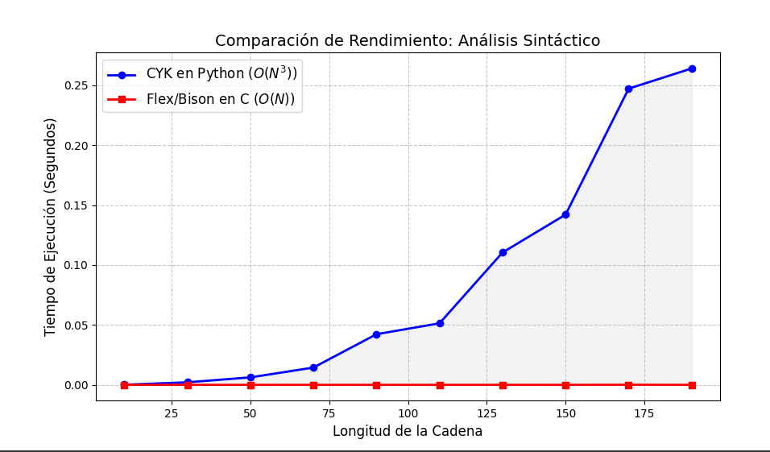

# Comparación de Rendimiento de Análisis Sintáctico: CYK vs Flex/Bison

## Introducción

El análisis sintáctico es un pilar fundamental en la teoría de compiladores. Este proyecto tiene como propósito enfrentar dos enfoques 
diametralmente opuestos para resolver el mismo problema (validar si una cadena pertenece a una gramática): el algoritmo académico CYK y 
un parser industrial generado mediante las herramientas Flex y Bison. El objetivo es evidenciar, mediante un benchmark riguroso, la abismal 
diferencia de rendimiento derivada no solo de la complejidad algorítmica inherente (O(N3) vs O(N)), sino también de la capa de abstracción del 
lenguaje de programación (Python interpretado vs C nativo).

## Objetivo General

Diseñar y ejecutar un entorno de pruebas comparativo que mida y visualice los tiempos de ejecución entre un algoritmo CYK (O(N3)) programado 
en Python y un autómata finito LALR(1) (O(N)) generado en C mediante Flex/Bison, procesando cadenas de texto de longitud incremental.

### Objetivos Específicos

1. Implementar el algoritmo CYK clásico en Python puro basándose en una gramática en Forma Normal de Chomsky (CNF).

2. Definir un analizador léxico (.l) y un analizador sintáctico (.y) equivalentes a la gramática CNF para compilar un parser nativo ultra rápido en lenguaje C.

3. Desarrollar un script orquestador que automatice la generación de cadenas de prueba aleatorias, recolecte los tiempos microscópicos de ambos programas mediante subprocesos y trace una curva de rendimiento usando matplotlib.

## Jerarquía de carpetas

La arquitectura del proyecto separa claramente las herramientas de generación C del script orquestador en Python:

```
/comparativa_rendimiento
│
├── comparador.py       # Script principal en Python (Orquestador, CYK y Gráficos)
├── lexer.l             # Definición del Analizador Léxico para Flex
├── parser.y            # Definición del Analizador Sintáctico y cronómetro para Bison
│
├── lex.yy.c            # Código C autogenerado por Flex (Tras compilación)
├── parser.tab.c        # Código C autogenerado por Bison (Tras compilación)
├── parser.tab.h        # Cabeceras de tokens generadas por Bison
└── parser_bison        # Ejecutable binario compilado nativo (Output final de gcc)
```

# Desarrollo
## Código fuente

A continuación se detalla el código fuente de los archivos clave del proyecto:

**Analizador Sintáctico en C (parser.y)**

Archivo de Bison que define la gramática equivalente. Contiene integraciones específicas de <time.h> 
dentro del main() para medir el tiempo de CPU exacto que tarda en procesar el árbol, sin la latencia de inicialización del sistema operativo.

```c
import subprocess
import time
import random
import matplotlib.pyplot as plt

GramaticaCNF = {
    'variaciones_no_terminales': {
        ('A', 'B'): 'S', ('B', 'C'): 'S',
        ('B', 'A'): 'A', ('C', 'C'): 'B', ('A', 'B'): 'C',
    },
    'variaciones_terminales': { 'a': ['A', 'C'], 'b': ['B'] },
    'simbolo_inicial': 'S'
}

def ejecutar_cyk(cadena, gramatica):
    n = len(cadena)
    if n == 0: return False
    tabla = [[set() for _ in range(n)] for _ in range(n)]
    term = gramatica['variaciones_terminales']
    non_term = gramatica['variaciones_no_terminales']
    
    for i in range(n):
        if cadena[i] in term:
            for nt in term[cadena[i]]: tabla[i][i].add(nt)
            
    for l in range(2, n + 1):
        for i in range(n - l + 1):
            j = i + l - 1
            for k in range(i, j):
                for b in tabla[i][k]:
                    for c in tabla[k+1][j]:
                        if (b, c) in non_term:
                            tabla[i][j].add(non_term[(b, c)])
                            
    return gramatica['simbolo_inicial'] in tabla[0][n-1]


def realizar_comparativa(n_max, pasos):
    longitudes = []
    tiempos_cyk = []
    tiempos_bison = []

    print("Iniciando Benchmark (CYK [Python] vs Flex/Bison [C Nativo])...")
    
    for n in range(10, n_max + 1, pasos):
        cadena = ''.join(random.choice(['a', 'b']) for _ in range(n))
        
        inicio_cyk = time.perf_counter()
        ejecutar_cyk(cadena, GramaticaCNF)
        fin_cyk = time.perf_counter()
        t_cyk = fin_cyk - inicio_cyk
        
        resultado = subprocess.run(["./parser_bison", cadena], capture_output=True, text=True)
        try:
            t_bison = float(resultado.stdout.strip())
        except ValueError:
            t_bison = 0.0 
            
        longitudes.append(n)
        tiempos_cyk.append(t_cyk)
        tiempos_bison.append(t_bison)
        
        print(f" N={n:03d} | CYK (Python): {t_cyk:.5f}s | Bison (C): {t_bison:.6f}s")

    plt.figure(figsize=(10, 6))
    plt.plot(longitudes, tiempos_cyk, 'o-', label='CYK en Python ($O(N^3)$)', color='blue', linewidth=2)
    plt.plot(longitudes, tiempos_bison, 's-', label='Flex/Bison en C ($O(N)$)', color='red', linewidth=2)
    
    plt.title('Comparación de Rendimiento: Análisis Sintáctico', fontsize=14)
    plt.xlabel('Longitud de la Cadena', fontsize=12)
    plt.ylabel('Tiempo de Ejecución (Segundos)', fontsize=12)
    plt.grid(True, linestyle='--', alpha=0.7)
    plt.legend(fontsize=12)
    
    plt.fill_between(longitudes, tiempos_cyk, tiempos_bison, color='gray', alpha=0.1)
    plt.show()

if __name__ == "__main__":
    realizar_comparativa(n_max=200, pasos=20)
 ```

# Salida Esperada

Al ejecutar el orquestador en terminal, se observará un registro incremental (log) que mostrará los tiempos para cada N probada:
```bash
Iniciando Benchmark (CYK [Python] vs Flex/Bison [C Nativo])...
 N=010 | CYK (Python): 0.00011s | Bison (C): 0.000009s
 N=030 | CYK (Python): 0.00213s | Bison (C): 0.000004s
 N=050 | CYK (Python): 0.00624s | Bison (C): 0.000006s
 N=070 | CYK (Python): 0.01443s | Bison (C): 0.000007s
 N=090 | CYK (Python): 0.04225s | Bison (C): 0.000005s
 N=110 | CYK (Python): 0.05136s | Bison (C): 0.000008s
 N=130 | CYK (Python): 0.11046s | Bison (C): 0.000011s
 N=150 | CYK (Python): 0.14208s | Bison (C): 0.000007s
 N=170 | CYK (Python): 0.24719s | Bison (C): 0.000088s
 N=190 | CYK (Python): 0.26403s | Bison (C): 0.000011s
```



inalizado el ciclo de pruebas, se abrirá una ventana de Matplotlib mostrando un gráfico lineal donde:

- La línea roja correspondiente a Bison se mantendrá estática en el eje X (prácticamente en 0 segundos) durante toda la ejecución.

- La línea azul correspondiente al algoritmo CYK en Python dibujará una evidente curva exponencial pronunciada, tardando una gran cantidad de tiempo a partir de cadenas superiores a 150 caracteres.

## Pasos de Ejecución

Instalar las dependencias en la distribución de Linux (Fedora):

```
sudo dnf install gcc bison flex python3-matplotlib
```

Compilar el Lexer y el Parser en el directorio del proyecto para generar el ejecutable nativo (parser_bison):

```
flex lexer.l
bison -d parser.y
gcc lex.yy.c parser.tab.c -o parser_bison -O3
```

Ejecutar el programa principal desde python.

```
python comparador.py
```

## Análisis del Algoritmo


El algoritmo CYK pertenece al paradigma de la programación dinámica y se diseña teóricamente para procesar cualquier gramática independiente 
del contexto siempre y cuando esté estructurada en Forma Normal de Chomsky. Su funcionamiento requiere evaluar progresivamente subcadenas de longitud 1 
hasta longitud N. El corazón de su latencia radica en su estructura de control iterativa: posee tres bucles for anidados que recorren la matriz diagonalmente
(Longitud, Punto Inicial, y Punto de División), lo que garantiza matemáticamente una complejidad cúbica O(N3). Como contraparte, la herramienta industrial 
Bison (usando tablas autogeneradas estilo LALR) recorre los estados del autómata finito de manera unidireccional y de arriba hacia abajo (Shift/Reduce), 
procesando cada token una única vez. Esto le provee una complejidad lineal teórica de O(N)

### Conclusiones


Superioridad Estructural: 
**El uso de generadores de parsers pre-compilados y optimizados mediante tablas predictivas es el único estándar 
viable en la industria moderna frente a enfoques iterativos puramente académicos como el CYK.**

Escalabilidad Cúbica Limitada: 
**Se evidencia empíricamente cómo algoritmos de O(N3) en lenguajes interpretados sufren cuellos de botella
intratables de procesamiento con inputs minúsculos (N > 150), volviéndolos inviables para analizar bloques reales de código o texto masivo.**

Impacto del Nivel Lenguaje: 
**Aparte de la teoría algorítmica, delegar las tareas pesadas a un binario compilado nativo de bajo nivel
(C) mediante una llamada del sistema permite explotar de manera eficiente la arquitectura del microprocesador frente a la máquina virtual interpretada de Python.**

