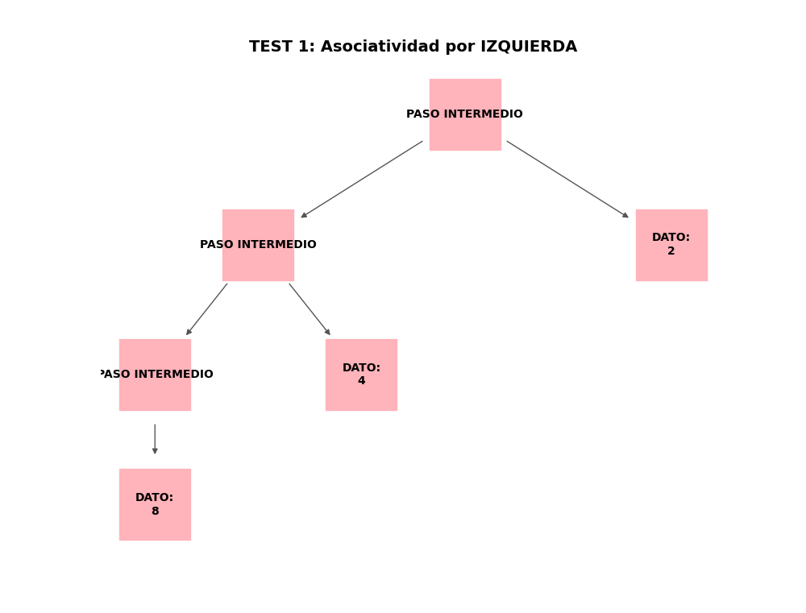
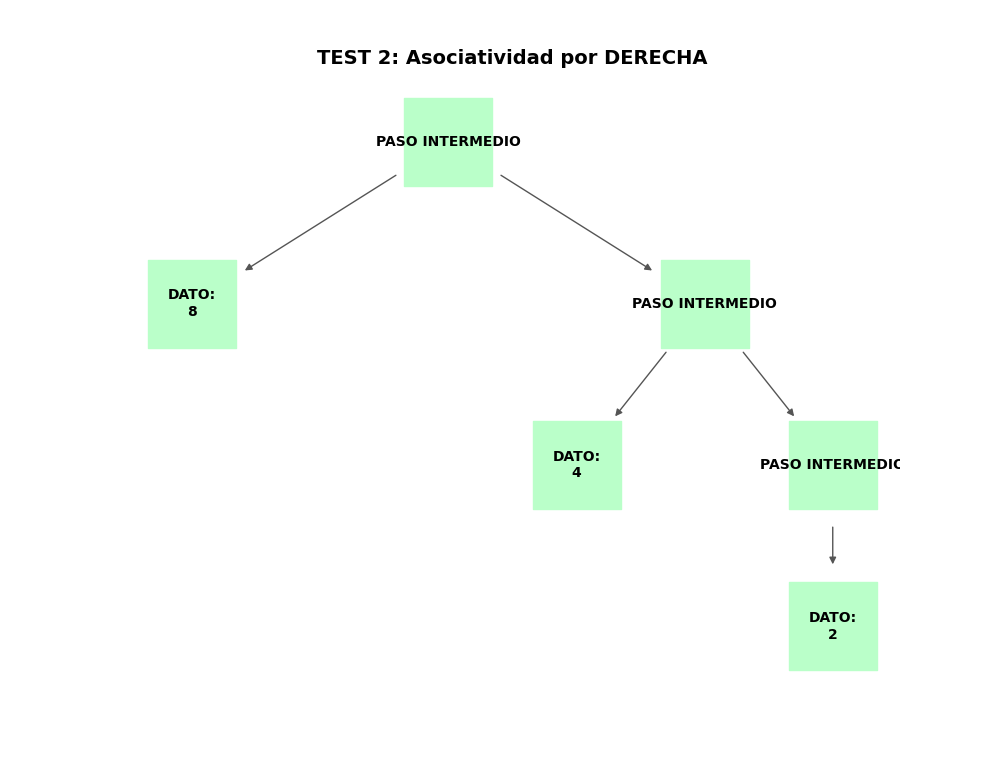
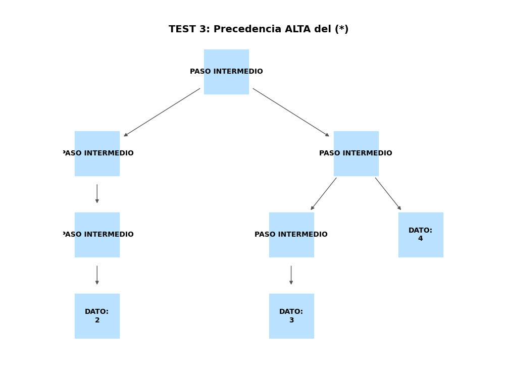
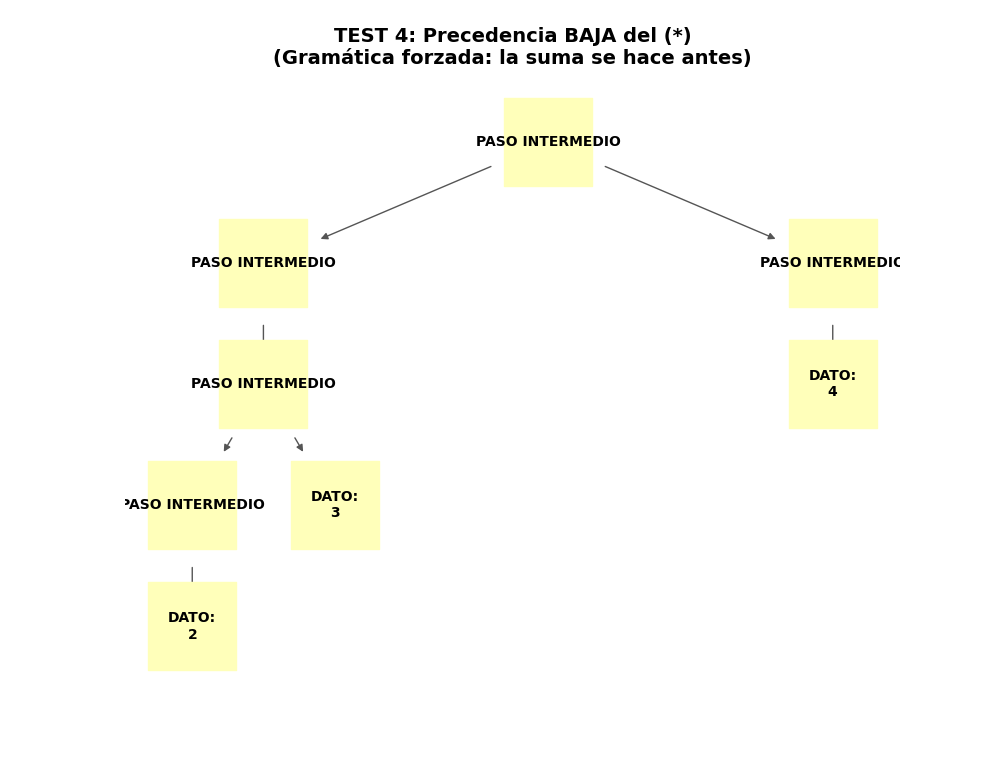

# Impacto de la Asociatividad y Precedencia en Gramáticas

## Introducción

En la construcción de analizadores sintácticos, definir correctamente las reglas de asociatividad (izquierda vs. derecha) y precedencia 
(orden de evaluación de los operadores) es crítico para garantizar que una expresión matemática se interprete de la manera correcta. 

## Objetivo General

Crear un visualizador gráfico automatizado que demuestre de forma didáctica y semántica las variaciones estructurales de un AST al modificar 
las propiedades de asociatividad y precedencia dentro de una gramática EBNF.

### Objetivos Específicos

Definir cuatro gramáticas independientes utilizando la herramienta Lark que modelen intencionalmente escenarios de asociatividad por izquierda/derecha y precedencia alta/baja de la multiplicación.

Implementar un traductor conceptual que convierta los tecnicismos propios de la gramática (nodos no terminales) en etiquetas semánticas amigables para facilitar su explicación al público.

Generar cuatro ventanas gráficas simultáneas empleando networkx y matplotlib para comparar la morfología de los árboles resultantes frente a expresiones matemáticas idénticas.

## Jerarquía de carpetas

En este programa, únicamente se usó un script principal, que contiene todo lo solicitado por el problema o algoritmo.

```
/visualizacion_gramaticas
│
└── comparador_gramaticas.py   # Script autónomo que contiene las gramáticas y el motor de renderizado visual
```

# Desarrollo


## Código fuente

El script comparador_gramaticas.py se encarga de definir las gramáticas, instanciar los parsers LALR(1), construir los grafos y generar el entorno visual con etiquetas semánticas.

```python
import matplotlib.pyplot as plt
import networkx as nx
from lark import Lark, Tree
import sys


# Asociatividad Izquierda
gramatica_izq = """
    ?start: expr
    expr: expr "-" NUMERO | NUMERO
    NUMERO: /\d+/
    %ignore " "
"""

# Asociatividad Derecha
gramatica_der = """
    ?start: expr
    expr: NUMERO "-" expr | NUMERO
    NUMERO: /\d+/
    %ignore " "
"""

# Precedencia Alta (*)
gramatica_prec_alta = """
    ?start: expr
    expr: expr "+" term | term
    term: term "*" NUMERO | NUMERO
    NUMERO: /\d+/
    %ignore " "
"""

# Precedencia Baja (*)
gramatica_prec_baja = """
    ?start: expr
    expr: expr "*" term | term
    term: term "+" NUMERO | NUMERO
    NUMERO: /\d+/
    %ignore " "
"""

DICCIONARIO_EXPLICATIVO = {
    'start': 'RAÍZ DEL CÁLCULO',
    'expr': 'OPERACIÓN',
    'term': 'TÉRMINO AGRUPADO',
    'NUMERO': 'VALOR NUMÉRICO',
    # Mapeo directo de signos para mayor claridad semántica
    '+': 'SUMA (+)',
    '-': 'RESTA (-)',
    '*': 'MULTIPLICACIÓN (*)',
    '/': 'DIVISIÓN (/)'
}

def procesar_y_dibujar_ventana_separada(gramatica, cadena, titulo, color, numero_ventana):
    """
    Genera el parser, crea el AST y abre una NUEVA ventana emergente 
    con etiquetas explicativas fáciles de entender.
    """
    try:
        parser = Lark(gramatica, parser='lalr')
        arbol = parser.parse(cadena)
    except Exception as e:
        print(f"Error analizando '{cadena}' para {titulo}: {e}")
        return

    plt.figure(numero_ventana, figsize=(10, 8))
    ax = plt.gca() # Obtener el eje actual de esta nueva figura
    
    grafo = nx.DiGraph()
    posiciones = {}
    
    # Función recursiva para construir el grafo visual con etiquetas conceptuales
    def recorrer(nodo, x=0, y=0, id_padre=None, ancho=2.0):
        nodo_id = str(id(nodo))
        
        if isinstance(nodo, Tree):
            # Es una Regla (No terminal): Buscamos su traducción conceptual
            nombre_tecnico = nodo.data
            etiqueta_conceptual = DICCIONARIO_EXPLICATIVO.get(nombre_tecnico, nombre_tecnico.upper())
            
            # Mejora especial: Si es una operación, intentar identificar cuál es mirando a los hijos
            if nombre_tecnico == 'expr' or nombre_tecnico == 'term':
                tiene_signo = False
                for hijo in nodo.children:
                    if not isinstance(hijo, Tree) and str(hijo) in DICCIONARIO_EXPLICATIVO:
                        signo_txt = str(hijo)
                        etiqueta_conceptual = f"OP. {DICCIONARIO_EXPLICATIVO[signo_txt]}"
                        tiene_signo = True
                        break
                if not tiene_signo:
                    etiqueta_conceptual = "PASO INTERMEDIO"

        else:
            # Es un Token (Terminal): Un número o un signo directo
            valor_texto = str(nodo)
            if valor_texto.isdigit():
                etiqueta_conceptual = f"DATO:\n{valor_texto}" # Mostramos el número claramente
            else:
                # Signos (+, -, *, /)
                etiqueta_conceptual = DICCIONARIO_EXPLICATIVO.get(valor_texto, valor_texto)

        grafo.add_node(nodo_id, label=etiqueta_conceptual)
        posiciones[nodo_id] = (x, y)
        if id_padre:
            grafo.add_edge(id_padre, nodo_id)
            
        if isinstance(nodo, Tree):
            # Cálculo de posiciones de hijos
            inicio_x = x - (ancho * (len(nodo.children) - 1)) / 2
            for i, hijo in enumerate(nodo.children):
                recorrer(hijo, inicio_x + i * ancho, y - 1, nodo_id, ancho / 2)

    recorrer(arbol)
    
    etiquetas = nx.get_node_attributes(grafo, 'label')
    nx.draw(grafo, pos=posiciones, ax=ax, with_labels=True, labels=etiquetas,
            node_size=4000, # Nodos más grandes para etiquetas más largas
            node_color=color, 
            font_size=10, # Fuente ligeramente más pequeña para que quepan las palabras
            font_weight="bold", 
            edge_color="#555555", # Gris oscuro para las flechas
            arrows=True, # Mostrar dirección del flujo
            node_shape='s') # Forma cuadrada para simular "bloques de concepto"
    
    ax.set_title(titulo, fontsize=14, fontweight='bold', pad=20)
    plt.axis('off') # Ocultar ejes coordenados

if __name__ == "__main__":
    print("Generando Gráficos")

    procesar_y_dibujar_ventana_separada(
        gramatica_izq, "8 - 4 - 2", 
        "TEST 1: Asociatividad por IZQUIERDA", 
        "#ffb3ba", numero_ventana=1
    )
                       
    procesar_y_dibujar_ventana_separada(
        gramatica_der, "8 - 4 - 2", 
        "TEST 2: Asociatividad por DERECHA", 
        "#baffc9", numero_ventana=2
    )
                       
    procesar_y_dibujar_ventana_separada(
        gramatica_prec_alta, "2 + 3 * 4", 
        "TEST 3: Precedencia ALTA del (*)", 
        "#bae1ff", numero_ventana=3
    )
                       
    procesar_y_dibujar_ventana_separada(
        gramatica_prec_baja, "2 + 3 * 4", 
        "TEST 4: Precedencia BAJA del (*)\n(Gramática forzada: la suma se hace antes)", 
        "#ffffba", numero_ventana=4
    )

    # Mostrar todas las ventanas generadas
    plt.show()
```

## Salida Esperada

Al correr el programa, la consola indicará la generación de los gráficos. Inmediatamente se abrirán cuatro ventanas emergentes separadas, 
cada una con un título descriptivo y un color distinto (rojo claro, verde claro, celeste y amarillo claro). Los nodos en los grafos tendrán 
forma cuadrada y presentarán etiquetas semánticas claras (ej. OP. RESTA (-), DATO: 8) en lugar de tecnicismos como "expr". Las conexiones entre nodos mostrarán flechas

**1. Asociatividad por Izquierda:**


### Explicación de la gráfica:

Esta gráfica demuestra visualmente cómo el compilador estructura la información cuando se aplica la **asociatividad por izquierda**. 

Al procesar la cadena `8 - 4 - 2`, podemos notar que el Árbol de Sintaxis Abstracto (AST) crece  hacia el flanco izquierdo. Como los compiladores resuelven las operaciones de abajo hacia arriba (desde las hojas hasta la raíz), este diseño garantiza que la máquina agrupe y evalúe primero los términos `8 - 4`. 

Matemáticamente, esta estructura obliga a resolver la ecuación como **`(8 - 4) - 2`**, lo cual es el comportamiento estándar y algebraicamente correcto para operadores como la resta o la división.

**2. Asociatividad por Derecha:**


### Explicación de la Gráfica:

Esta gráfica ilustra el comportamiento del compilador cuando se fuerza una **asociatividad por derecha**.

A diferencia del caso anterior, al procesar la misma cadena `8 - 4 - 2`, el árbol crece hacia el flanco derecho. Siguiendo la regla de evaluación de abajo hacia arriba (desde las hojas hasta la raíz), el compilador primero toma los nodos más profundos, agrupando y resolviendo primero la operación `4 - 2`.

Matemáticamente, esta estructura altera por completo el orden de la evaluación, resolviendo la ecuación como **`8 - (4 - 2)`**. Aunque este comportamiento no es el estándar ni el correcto para una resta, es exactamente el diseño arquitectónico que utilizan los lenguajes de programación para evaluar operadores como la **potenciación o los exponentes**, donde una expresión como $2^{3^2}$ siempre debe agruparse y resolverse como $2^{(3^2)}$.


**3. Precedencia Alta (*):**


### Explicación de la Gráfica:

Esta gráfica evidencia cómo la gramática maneja la **precedencia alta** del operador de multiplicación frente a la suma, respetando estrictamente la jerarquía matemática universal.

Al analizar la expresión `2 + 3 * 4`, el árbol ubica el bloque de la `OP. MULTIPLICACIÓN (*)` en un nivel mucho más profundo que la `OP. SUMA (+)`. Dado que el compilador siempre resuelve el árbol desde las hojas inferiores hacia la raíz (de abajo hacia arriba), la máquina se ve obligada a procesar primero los términos `3 * 4`.

Matemáticamente, el resultado de esa multiplicación se propaga hacia arriba en el árbol para, finalmente, sumarse con el `2`. Esta estructura representa fielmente la agrupación **`2 + (3 * 4)`**, demostrando cómo el diseño de la gramática garantiza que el compilador jamás confunda el orden de las operaciones.

**4. Precedencia Baja (*):**



### Explicación del Algoritmo

Esta gráfica ilustra un escenario modificado intencionalmente donde se le asigna **precedencia baja** a la multiplicación (forzando a que la suma tenga mayor prioridad).

Usando la misma cadena `2 + 3 * 4`, observamos que la estructura del árbol se invierte por completo respecto al caso anterior. Ahora, el bloque de la `OP. SUMA (+)` es el que se encuentra hundido en la parte más profunda del árbol, dejando a la multiplicación en la raíz. 

Al evaluar de abajo hacia arriba, el compilador ejecutará primero la suma de `2 + 3`. Matemáticamente, esto altera el significado de la expresión, resolviéndola como **`(2 + 3) * 4`**. Esto demuestra visualmente el grave impacto lógico que puede tener definir mal la jerarquía (precedencia) de los operadores durante la creación de un lenguaje de programación o un analizador sintáctico.

### Conclusión de las Gráficas

En conclusión, estas cuatro gráficas demuestran visualmente una regla de oro en el diseño de compiladores: **la geometría estructural del Árbol de Sintaxis Abstracto (AST) dicta exactamente el orden de ejecución de las operaciones.**

Podemos resumir el comportamiento matemático de la máquina en dos principios fundamentales:

1. **El Principio de Asociatividad (Dirección del árbol):** Cuando los operadores tienen el mismo nivel de importancia (como múltiples restas), la asociatividad define si el árbol "crece" hacia la izquierda o hacia la derecha, determinando el sentido de la lectura secuencial.
2. **El Principio de Precedencia (Profundidad del árbol):** Cuando los operadores tienen distinta importancia (como una suma y una multiplicación), la precedencia define qué tan "profundo" se entierra un nodo. **La regla absoluta de un compilador es: lo que está más abajo en las hojas, se evalúa primero.**

Como pudimos observar, cualquier error al definir la precedencia o la asociatividad en las reglas de la gramática resultará en un árbol invertido o mal estructurado, lo que inevitablemente llevará a la máquina a realizar cálculos matemáticamente incorrectos de manera silenciosa (como se evidenció en el Test 2 y el Test 4).

## Pasos de Ejecución

Instalar las librerias y dependendicas necesarias

```
pip install lark-parser networkx matplotlib
```

Ejecutar el script principal

```
python comparador_gramaticas.py
```

Acomodar al gusto las 4 ventanas con las gráficas solicitadas para su mejor visibilidad y análisis.


## Análisis del Algoritmo

El script aprovecha el motor LALR de Lark para materializar las gramáticas estipuladas. La recursividad sintáctica (por ejemplo, expr "-" NUMERO vs NUMERO "-" expr) 
obliga al autómata a agrupar los tokens de forma divergente. Una gramática asociada por izquierda fuerza al parser a construir el árbol "hundiéndose" hacia el flanco izquierdo, 
implicando que los cálculos más tempranos operan de izquierda a derecha de la cadena (comportamiento natural de la resta). Para ilustrar la precedencia, el algoritmo desplaza 
artificialmente los bloques operativos expr y term. Al colocar la regla de la suma por debajo de la multiplicación (Precedencia Baja), se invierte el estándar algebraico, 
obligando a que el nodo de la "suma" quede sepultado más profundo en el árbol garantizando así que se ejecute primero durante una evaluación ascendente (bottom-up).

# Conclusiones

- Traducción Semántica: El uso de un diccionario de mapeo para modificar las etiquetas de los árboles en tiempo de ejecución resulta en diagramas autoexplicativos, cerrando la brecha entre la teoría de autómatas abstractos y la didáctica de la programación.

- Geometría de la Precedencia: Queda visualmente evidenciado que la precedencia matemática está ligada intrínsecamente a la "profundidad" de un nodo en el AST; los nodos alojados más abajo en las hojas obligatoriamente deben resolverse antes de que la información fluya hacia la raíz.

- Recursividad y Asociatividad: Alterar la recursividad (colocando la no-terminal a la izquierda o derecha del operador) es el mecanismo fundamental en analizadores LR/LALR para resolver ambigüedades como 8 - 4 - 2, previniendo errores graves de cálculo en compiladores comerciales.
